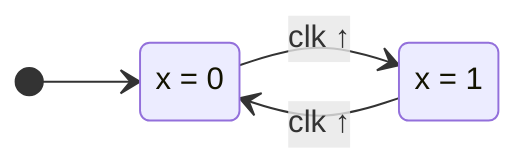
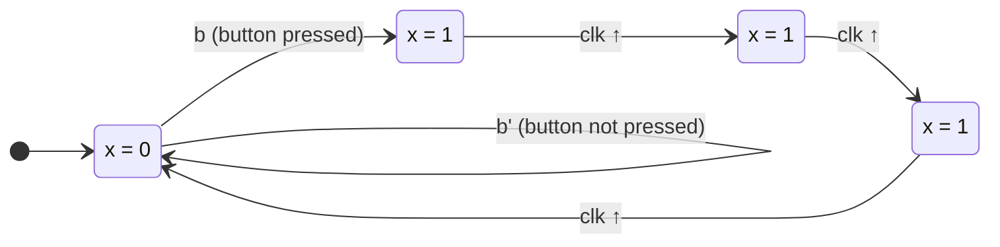
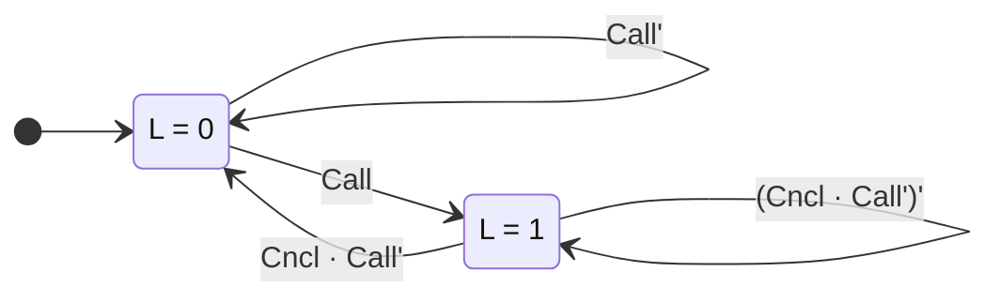
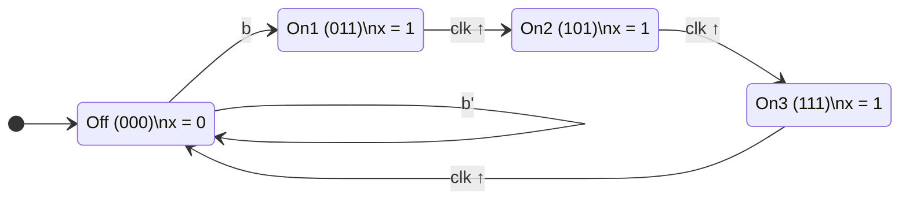
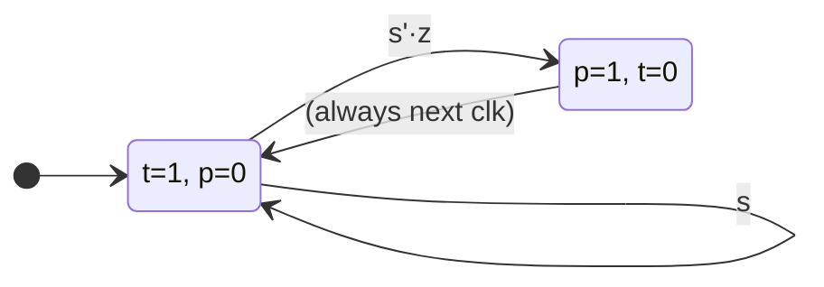
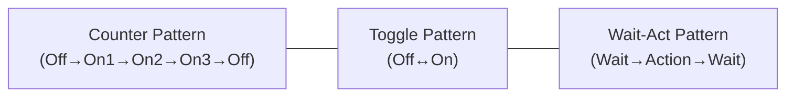

# 🧠 FSM (Finite-State Machine) Design — Complete Learning Guide

> Based on **Chapter 3 — Digital Design (Frank Vahid)** — Part 2  
> Covers: FSM fundamentals → Controller Design Process → Worked Problems → Glitching

---

## Table of Contents

1. [Why FSMs?](#1-why-fsms)
2. [What is a Finite-State Machine?](#2-what-is-a-finite-state-machine)
3. [FSM Components](#3-fsm-components)
4. [Example 1 — Simple Toggle](#4-example-1--simple-toggle)
5. [Example 2 — Three-Cycles-High Laser Timer](#5-example-2--three-cycles-high-laser-timer-full-walkthrough)
6. [The 5-Step Controller Design Process](#6-the-5-step-controller-design-process)
7. [Step-by-Step: Laser Timer → Circuit](#7-step-by-step-laser-timer--circuit)
8. [Example 3 — Call/Cancel Light Controller](#8-example-3--callcancel-light-controller)
9. [Output Glitching & Solutions](#9-output-glitching--solutions)
10. [Example 4 — Pacemaker (Real-World FSM)](#10-example-4--pacemaker-real-world-fsm)
11. [Quick Reference Cheat Sheet](#11-quick-reference-cheat-sheet)

---

## 1. Why FSMs?

### The Problem with Trial-and-Error

When you design **combinational circuits**, you have:
- ✅ A formal way to describe behavior → **Boolean equations / Truth tables**
- ✅ A well-defined process → **Convert equations to gates**

But for **sequential circuits** (circuits with memory/state), trial-and-error doesn't work:

> **Example:** You need a laser timer that outputs `x=1` for exactly 3 clock cycles after a button press. Can you just "guess" a circuit? What if someone presses the button *again* while `x=1`? What happens with 9 states? 100 states?

**Solution:** We need **FSMs** — a formal mathematical model for sequential behavior, just like Boolean equations are for combinational behavior.

---

## 2. What is a Finite-State Machine?

> An FSM is a mathematical model that describes the behavior of a sequential circuit by listing all possible **states** and the **transitions** between them.

Think of it like a **flowchart with memory** — the machine is always in exactly **one state**, and it moves to another state based on inputs and clock edges.

### Real-Life Analogy
A traffic light is an FSM:
- **States:** 🔴 Red, 🟡 Yellow, 🟢 Green
- **Transitions:** Red → Green → Yellow → Red (on timer)
- **Outputs:** Which light is ON

---

## 3. FSM Components

Every FSM has exactly **5 components**:

| Component | Symbol | Description |
|-----------|--------|-------------|
| **States** | Circles/ovals | All possible conditions the machine can be in |
| **Inputs** | Letters (b, x...) | External signals that affect transitions |
| **Outputs** | Letters (x, L...) | Signals produced in each state |
| **Transitions** | Arrows between states | Rules for moving from one state to another |
| **Initial State** | Arrow from nowhere | The state the machine starts in (on power-up) |

### FSM Notation in Diagrams

```
     ┌──────────────────────────────────────────────┐
     │                                              │
     │   ──►  = Initial state indicator             │
     │                                              │
     │   (State)  = A state (circle/oval)           │
     │    Name                                      │
     │                                              │
     │   condition / output                         │
     │   ──────────────►  = Transition arrow         │
     │   (from one state to another)                │
     │                                              │
     │   condition (on arrow) = When to transition  │
     │   output (inside state) = What to output     │
     └──────────────────────────────────────────────┘
```

---

## 4. Example 1 — Simple Toggle

### Problem
> Design a circuit whose output `x` toggles (switches between 0 and 1) on every rising clock edge.

### FSM State Diagram



### Explanation

| Current State | Clock Edge | Next State | Output x |
|:---:|:---:|:---:|:---:|
| **Off** | Rising ↑ | On | 0 → 1 |
| **On** | Rising ↑ | Off | 1 → 0 |

- Only **2 states** → need **1 flip-flop** (2¹ = 2 states)
- Output `x` simply equals the state bit

> [!TIP]
> **State count determines flip-flop count:**  
> `n` flip-flops → `2ⁿ` possible states  
> So: 2 states → 1 FF, 4 states → 2 FFs, 8 states → 3 FFs

---

## 5. Example 2 — Three-Cycles-High Laser Timer (Full Walkthrough)

### Problem Statement
> A patient lies under a laser and presses button `b`. The laser (`x`) must turn on for **exactly 3 clock cycles**, then turn off. It stays off until `b` is pressed again.

### Step 1: Identify the States

We need the laser ON for exactly 3 cycles. So we need to *count* the cycles:

| State | Meaning | Output x |
|:---:|:---|:---:|
| **Off** | Laser is off, waiting for button | 0 |
| **On1** | Laser on — 1st cycle | 1 |
| **On2** | Laser on — 2nd cycle | 1 |
| **On3** | Laser on — 3rd cycle | 1 |

### Step 2: Draw the FSM



### How It Works (Cycle by Cycle)

```
  Clock Cycle:    1     2     3     4     5     6     7     8
  ─────────────────────────────────────────────────────────────
  Button b:       0     1     0     0     0     0     1     0
  State:         Off   Off   On1   On2   On3   Off   Off   On1
  Output x:       0     0     1     1     1     0     0     1
  ─────────────────────────────────────────────────────────────
                        ↑                             ↑
                   b pressed                     b pressed
                   (takes effect                 again
                    next cycle)
```

> [!IMPORTANT]
> The button press is captured on the **rising clock edge**. The state changes on the **next** rising clock edge after the condition is true.

### Key Design Decisions

1. **Why 4 states?** → We need to count 3 "on" cycles + 1 "off" state
2. **Why does Off loop to itself?** → While `b=0`, nothing happens
3. **Why do On1→On2→On3 have no conditions?** → They always advance on clock edge (unconditional transitions)
4. **What if button is pressed during On1/On2/On3?** → The FSM ignores it! It continues its 3-cycle sequence

---

## 6. The 5-Step Controller Design Process

This is the **most important concept** — converting an FSM diagram into an actual working circuit.

### Overview Table

| Step | Name | What You Do |
|:---:|:---|:---|
| **1** | Capture the FSM | Draw the state diagram |
| **2A** | Set up architecture | State register + combinational logic block |
| **2B** | Encode the states | Assign binary numbers to each state |
| **2C** | Fill the truth table | Create truth table from FSM transitions |
| **2D** | Implement combinational logic | Derive Boolean equations → draw gates |

### The Standard Architecture

Every FSM controller has the **same** architecture:

```
                    ┌─────────────────────┐
         b ───────►│                     ├──────► x (output)
                   │   Combinational     │
              ┌───►│      Logic          ├──► n1 (next state)
              │    │                     ├──► n0 (next state)
              │    └─────────────────────┘
              │              ▲
              │    ┌─────────┴───────────┐
         s1 ──┘   │                     │
         s0 ──────│   State Register    │◄──── clk
                   │   (D Flip-Flops)   │
                   └─────────────────────┘
```

**How it works:**
1. On each **rising clock edge**, the state register captures `n1, n0` and stores them as `s1, s0`
2. The combinational logic reads the current state (`s1, s0`) and input (`b`)
3. It computes the **output** (`x`) and the **next state** (`n1, n0`)
4. Repeat!

---

## 7. Step-by-Step: Laser Timer → Circuit

Let's convert the Three-Cycles-High Laser Timer FSM into an actual circuit.

### Step 1: Capture the FSM ✅

Already done above — 4 states (Off, On1, On2, On3), input `b`, output `x`.

### Step 2A: Set Up Architecture ✅

- **4 states** → need **2 flip-flops** (2² = 4)
- State register stores `s1, s0` (current state)
- Combinational logic computes `x, n1, n0` from `s1, s0, b`

### Step 2B: Encode the States

Assign a unique binary number to each state:

| State | s1 | s0 | Encoding |
|:---:|:---:|:---:|:---:|
| **Off** | 0 | 0 | `00` |
| **On1** | 0 | 1 | `01` |
| **On2** | 1 | 0 | `10` |
| **On3** | 1 | 1 | `11` |

> [!NOTE]
> Any encoding works as long as each state has a **unique** binary number. Counting up in binary (00, 01, 10, 11) is the simplest approach.

### Step 2C: Fill the Truth Table

Now we translate every FSM transition into a truth table row. For each combination of current state (`s1, s0`) and input (`b`), determine the output (`x`) and next state (`n1, n0`).

| **State** | **s1** | **s0** | **b** | **x** | **n1** | **n0** | **Explanation** |
|:---:|:---:|:---:|:---:|:---:|:---:|:---:|:---|
| Off | 0 | 0 | 0 | 0 | 0 | 0 | b=0: stay in Off |
| Off | 0 | 0 | 1 | 0 | 0 | 1 | b=1: go to On1 |
| On1 | 0 | 1 | 0 | 1 | 1 | 0 | always go to On2 |
| On1 | 0 | 1 | 1 | 1 | 1 | 0 | always go to On2 |
| On2 | 1 | 0 | 0 | 1 | 1 | 1 | always go to On3 |
| On2 | 1 | 0 | 1 | 1 | 1 | 1 | always go to On3 |
| On3 | 1 | 1 | 0 | 1 | 0 | 0 | always go to Off |
| On3 | 1 | 1 | 1 | 1 | 0 | 0 | always go to Off |

#### How to read each row:

> **Row 2:** Current state is Off (`s1=0, s0=0`), button pressed (`b=1`).  
> From FSM: Off → On1 when b=1.  
> On1 encoding is `01`, so `n1=0, n0=1`.  
> Off's output is `x=0`.

> **Row 3:** Current state is On1 (`s1=0, s0=1`), b=0.  
> From FSM: On1 → On2 (unconditional).  
> On2 encoding is `10`, so `n1=1, n0=0`.  
> On1's output is `x=1`.

### Step 2D: Derive Boolean Equations

From the truth table, derive the equation for each output:

**For x (FSM output):**
Look at where x = 1 in the truth table:

```
x = 1 when:  (s1=0, s0=1, b=0) OR (s1=0, s0=1, b=1) 
             OR (s1=1, s0=0, b=0) OR (s1=1, s0=0, b=1)
             OR (s1=1, s0=1, b=0) OR (s1=1, s0=1, b=1)
```

Simplifying (b doesn't matter for any of these):

```
x = s1's0 + s1s0' + s1s0
x = s0 + s1
```

> ✅ **x = s1 + s0** (output is 1 whenever we're NOT in the Off state)

**For n1 (next state bit 1):**
Look at where n1 = 1:

```
n1 = 1 when: (s1=0, s0=1) OR (s1=1, s0=0)
             [regardless of b]
```

```
n1 = s1's0 + s1s0'
```

> ✅ **n1 = s1 ⊕ s0** (XOR — n1 = s1 XOR s0)

**For n0 (next state bit 0):**
Look at where n0 = 1:

```
n0 = 1 when: (s1=0, s0=0, b=1) OR (s1=1, s0=0, b=0) OR (s1=1, s0=0, b=1)
```

Simplifying:

```
n0 = s1's0'b + s1s0'
```

> ✅ **n0 = s1's0'b + s1s0'**

### Final Circuit Implementation

```
 Inputs: b, s1, s0
 ┌─────────────────────────────────────────────────────────┐
 │                                                         │
 │   x  = s1 OR s0              → 1 OR gate               │
 │                                                         │
 │   n1 = s1 XOR s0             → 1 XOR gate              │
 │                                                         │
 │   n0 = s1'·s0'·b + s1·s0'   → AND/OR gates             │
 │       = s0'·(s1'·b + s1)                                │
 │       = s0'·(s1 + b)        ← simplified!               │
 │                               → 1 OR + 1 AND + 1 NOT   │
 └─────────────────────────────────────────────────────────┘
```

> [!TIP]
> **Simplification trick for n0:**  
> `s1'·s0'·b + s1·s0'` → Factor out `s0'` → `s0'·(s1'b + s1)` → Using Boolean identity `A'B + A = A + B` → `s0'·(s1 + b)`

---

## 8. Example 3 — Call/Cancel Light Controller

### Problem
> Hospital call light: Nurse presses **Call** to turn light ON. Light stays on. Nurse presses **Cncl** (cancel) to turn it OFF. If both Call and Cncl are pressed simultaneously, light stays in current state.

### Inputs/Outputs
- **Inputs:** `Call`, `Cncl`
- **Output:** `L` (light: 1=ON, 0=OFF)

### FSM State Diagram



### Transition Logic Explained

| Current State | Condition | Next State | Why? |
|:---:|:---|:---:|:---|
| LightOff | Call = 0 | LightOff | No call → stay off |
| LightOff | Call = 1 | LightOn | Call pressed → turn on |
| LightOn | Cncl=1 AND Call=0 | LightOff | Cancel only → turn off |
| LightOn | Otherwise | LightOn | Stay on (Call overrides Cancel) |

### Design (2 States → 1 Flip-Flop)

| State | s0 |
|:---:|:---:|
| LightOff | 0 |
| LightOn | 1 |

### Truth Table

| **s0** | **Call** | **Cncl** | **L** | **n0** |
|:---:|:---:|:---:|:---:|:---:|
| 0 | 0 | 0 | 0 | 0 |
| 0 | 0 | 1 | 0 | 0 |
| 0 | 1 | 0 | 0 | 1 |
| 0 | 1 | 1 | 0 | 1 |
| 1 | 0 | 0 | 1 | 1 |
| 1 | 0 | 1 | 1 | 0 |
| 1 | 1 | 0 | 1 | 1 |
| 1 | 1 | 1 | 1 | 1 |

### Boolean Equations

```
L  = s0

n0 = s0'·Call + s0·Cncl'  + s0·Call
   = s0'·Call + s0·(Cncl' + Call)
   = s0'·Call + s0·(Cncl·Call')'
```

> Simplified: **n0 = Call + s0·Cncl'**

---

## 9. Output Glitching & Solutions

### What is Glitching?

> **Glitching** = temporary incorrect output values that appear briefly when the combinational logic is computing new outputs after a state change.

### Why It Happens

When the state register changes (e.g., from `01` to `10`), the bits don't change at exactly the same instant. For a brief moment, the state might be `00` or `11` — causing the combinational logic to produce **wrong outputs** temporarily.

```
  State transition:  01 → 10
  
  What SHOULD happen:   01 ──────────► 10
  
  What ACTUALLY happens: 01 → 00 → 10   (s0 changes first)
                              or
                         01 → 11 → 10   (s1 changes first)
                              ↑
                         GLITCH! Wrong state briefly exists
```

### Solution 1: Registered Outputs

Add a **D flip-flop** on each output:

```
  Combinational Logic ──► x (glitchy) ──► [D Flip-Flop] ──► xr (clean)
                                              ▲
                                             clk
```

- The flip-flop only captures `x` on the clock edge (when it's stable)  
- **Trade-off:** Output is delayed by **one clock cycle**

### Solution 2: Use State Variables as Outputs

Choose your **state encoding** so that the state bits themselves serve as the outputs!

**Example for Laser Timer:**

| State | s2 | s1 | s0 | x (desired output) |
|:---:|:---:|:---:|:---:|:---:|
| Off | 0 | 0 | 0 | 0 |
| On1 | 0 | 1 | 1 | 1 |
| On2 | 1 | 0 | 1 | 1 |
| On3 | 1 | 1 | 1 | 1 |

Here, **x = s0** — the output comes directly from a flip-flop, so it's **glitch-free** without any extra hardware!



> [!TIP]
> **State-as-output encoding** may require more flip-flops (3 instead of 2 for 4 states), but eliminates glitching without adding output delay!

### Comparison

| Method | Glitch-Free? | Extra Hardware | Output Delay |
|:---:|:---:|:---:|:---:|
| No fix | ❌ | None | None |
| Registered outputs | ✅ | 1 D-FF per output | +1 clock cycle |
| State-as-output | ✅ | May need more state FFs | None |

---

## 10. Example 4 — Pacemaker (Real-World FSM)

### What Is a Pacemaker?

A pacemaker is a small device implanted in the chest that uses electrical pulses to keep the heart beating at a regular rhythm.

### FSM Design



### Inputs/Outputs

| Signal | Type | Meaning |
|:---|:---:|:---|
| **s** | Input | Heart sensor (1 = heartbeat detected) |
| **z** | Input | Timer expired (1 = time's up) |
| **t** | Output | Timer control (1 = reset timer) |
| **p** | Output | Pace pulse (1 = send electrical pulse) |

### How It Works

1. **Wait state**: Timer is running (`t=1` resets/starts it), no pacing (`p=0`)
   - If heartbeat detected (`s=1`): Stay in Wait, reset timer → heart is fine!
   - If timer expires (`z=1`) without heartbeat: Heart missed a beat! → Go to Pace
2. **Pace state**: Send electrical pulse (`p=1`), timer stopped (`t=0`)
   - Immediately return to Wait on next clock edge

> [!IMPORTANT]
> This is a **safety-critical** FSM! A bug here could harm the patient. This shows why formal FSM design (not trial-and-error) is essential.

---

## 11. Quick Reference Cheat Sheet

### FSM Design Checklist

```
□ Step 1:  Draw FSM state diagram
           • Identify all states
           • Define inputs and outputs
           • Draw all transitions with conditions
           • Mark initial state

□ Step 2A: Set up architecture
           • Count states → determine # of flip-flops
           • Draw: inputs → [Combinational Logic] → outputs
                                  ↕
                           [State Register] ← clk

□ Step 2B: Encode states
           • Assign unique binary codes to each state
           • n flip-flops → 2ⁿ possible states

□ Step 2C: Create truth table
           • Inputs:  current state bits + FSM inputs
           • Outputs: FSM outputs + next state bits
           • One row per input combination per state

□ Step 2D: Implement combinational logic
           • Derive Boolean equations from truth table
           • Simplify (algebra, K-maps, etc.)
           • Draw gate-level circuit
```

### Key Formulas

| Need | Formula |
|:---|:---|
| # Flip-flops needed | ⌈log₂(# states)⌉ |
| 2 states | 1 flip-flop |
| 3–4 states | 2 flip-flops |
| 5–8 states | 3 flip-flops |
| 9–16 states | 4 flip-flops |

### Common FSM Patterns



| Pattern | Use Case | Example |
|:---|:---|:---|
| **Counter** | Do something for N cycles | Laser timer |
| **Toggle** | Alternate between two states | Clock divider |
| **Wait-Act** | Wait for trigger, act, return | Pacemaker |
| **Sequence Detector** | Detect input pattern | Security code |

---

## Practice Problems

### Problem 1: 2-Cycle Delay
> Design an FSM that outputs `y=1` exactly **2 clock cycles** after input `a` becomes 1.

<details>
<summary>💡 Hint</summary>

You need 3 states: Wait, Delay1, Delay2. When `a=1`, go from Wait→Delay1→Delay2(y=1)→Wait.

</details>

### Problem 2: Sequence Detector
> Design an FSM that outputs `z=1` when it detects the input sequence `1, 0, 1` on input `w`.

<details>
<summary>💡 Hint</summary>

You need 4 states: S0 (initial), Got1 (seen "1"), Got10 (seen "1,0"), Got101 (seen "1,0,1" → z=1). Consider overlapping sequences!

</details>

### Problem 3: Vending Machine
> A vending machine accepts nickels (N) and dimes (D). It dispenses a drink (output `dispense=1`) when 15 cents or more is inserted. Design the FSM.

<details>
<summary>💡 Hint</summary>

States represent cents accumulated: S0(0¢), S5(5¢), S10(10¢), S15(15¢+dispense).

</details>

---

> **📚 Source:** Frank Vahid, *Digital Design*, Chapter 3 — Sequential Logic Design: Controllers  
> **🎯 Key Takeaway:** FSMs provide a **formal, systematic** way to design sequential circuits. Always use the 5-step process — never guess!
